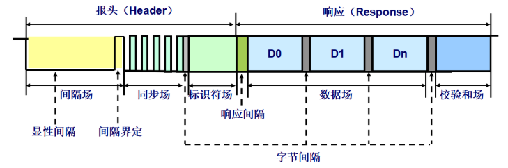
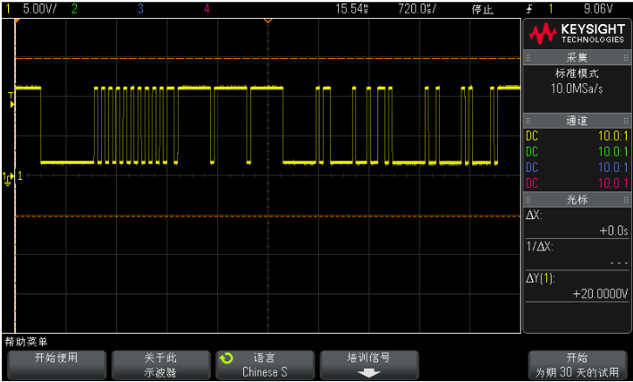
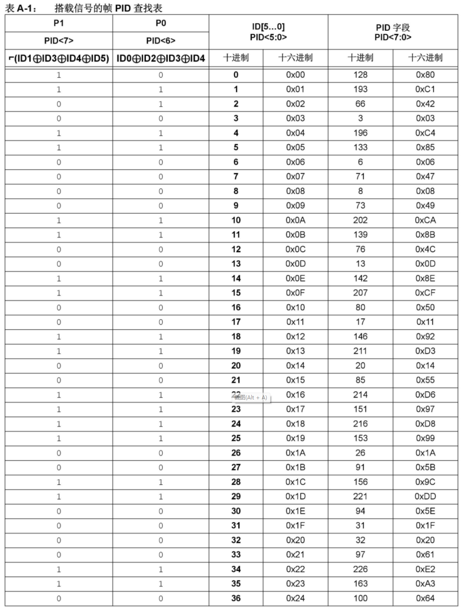
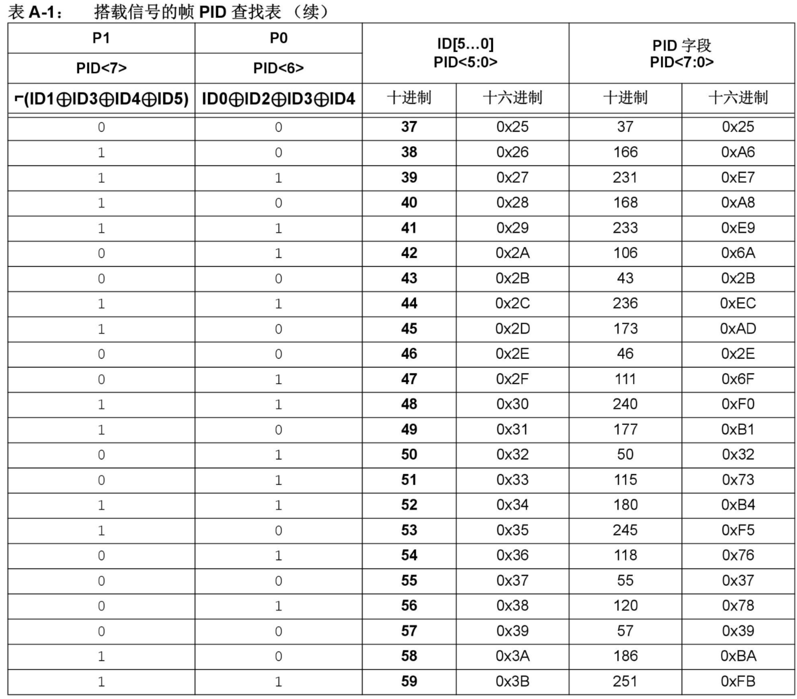

# LIN 的简介

LIN 总线的一帧主要由两部分组成，即 **报文头（Header）** 和 **报文响应（Response）**。

其中：

- 报文头是由一个主机节点的主机任务发出的
- 报文响应（以下简称响应）是由一个主机节点或从机节点的从机任务发出的

其中报文头由以下三部分组成：

- 同步间隔场（最小 13 个显性位）
- 同步场（1 个字节，数据不变，`0x55`）
- PID 场（1 个字节）

报文响应由以下部分组成：

- `2 / 4 / 8` 个字节的数据场
- 校验和场（1 个字节）

报文头和响应之间有一个帧内空间分隔，最小空间为 `0`。



---

LIN 的字节场格式就是通常的“SCI”或“UART”串行数据格式（N81 编码）。

即每个字节场的长度是 **10 个位定时（BIT TIME）**：

- `1 bit` 起始位
- `8 bits` 数据位
- `1 bit` 停止位



---

PID 场定义了报文的内容和长度。

如图，PID 场分为：

- `6` 个标识符位
- `2` 个 ID 奇偶校验位

6 个标识符位我们称之为 **ID**。  
如果加上 2 个奇偶校验位就变成 **PID**，即 **Protected ID**。

6 个标识符位中，标识符后两位为数据长度控制位。总的来看，ID 的范围是 `0 ~ 0x3F`。

注意是 **ID**，不是 **PID**，要区分开。

这一段要讲的是我们需要将 LIN 的 **ID** 与 **PID** 分清楚，不能混淆。

```c
#include <stdio.h>
#include <windows.h>

int main()
{
	short p0 = 0, p1 = 0;
	short LIN_ID = 0x22, PID = 0x00;

	p0 = (LIN_ID & 0x01) ^ ((LIN_ID & 0x02) >> 1) ^ ((LIN_ID & 0x04) >> 2) ^ ((LIN_ID & 0x10) >> 4); // 按位异或
	p0 = p0 & 0x01;

	p1 = ~(((LIN_ID & 0x02) >> 1) ^ ((LIN_ID & 0x08) >> 3) ^ ((LIN_ID & 0x10) >> 4) ^ ((LIN_ID & 0x20) >> 5));
	p1 = p1 & 0x01;

	PID = (p1 << 7) | (p0 << 6) | LIN_ID;
	printf("p0=%#x,p1=%#x,PID=%#X\n", p0, p1, PID);

	system("pause");
	return 0;
}
```





---

## 校验和场（checksum）

校验和场是数据场所有字节的和的反码。所有数据字节的和的补码，与校验和字节相加所得的和必须是 `0xFF`。

校验和场通常会有两种不同的类型，英文简称为 **CST（Checksum Type）**：

- `classic checksum`（LIN 1.3）
- `enhanced checksum`（LIN 2.0 及以上）

`classic` 即只对 **Data（数据场）** 进行校验和的计算。  
`Enhanced Checksum` 在计算时需要把 **PID** 也加入到计算队列中。

### 算法（Classical）

累加所有字节。对每次加和进行判断，如果和大于 `0xFF`，那么就把高八位的 `1` 与低八位相加，其实就是低八位加 `1`（翻转八位和）。得到最后的结果后，取其反码，我们就得到了最后的校验和。

```text
(NOT)(DATA_Byte1 + ...... + DATA_Byte8)
```

其中 `DATA_Bytex` 相加超过 `0xFF` 的时候则降八位，比如：

```text
0x132 > 0xFF
分解为：
0x1 和 0x32
突出的高 8 位删除，加到低 8 位中：
0x1 + 0x32 = 0x33
增强校验的形式为：
(NOT)(DATA_Byte1 + ...... + DATA_Byte8 + PID)
```

---

标识符为 `0x3C` 和 `0x3D` 的帧只能使用 **经典校验**，这两组帧是 LIN 的诊断帧。

即 LIN 2.0 及以上才有的诊断帧，需要使用经典校验，**不能将 PID 也加入到校验计算序列**。自己写 LIN 驱动的小伙伴要格外注意。

---

# LIN 帧的分类

LIN 帧按照帧类型来分类可以分为：

- 普通帧
- 事件触发帧
- 零星帧
- 诊断帧
- 用户自定义帧
- 保留帧

---

## 普通帧

普通帧的标识符（ID）为 `0 ~ 0x3B`。

主任务发出报文头，一个任务响应，一个或多个任务接收。

---

## 事件触发帧

事件触发帧的标识符为 `0 ~ 0x3B`。

事件触发帧必须有一个独立的 ID，该 ID 可以与多个普通帧相关联。

在事件触发帧时隙内发送帧头，只有当相关联的无条件帧内有信号被更新时，才发送帧响应。

帧响应的第一个数据字节等于标识符，即响应最多可以传输 `7` 个字节的数据；如果没有帧响应，帧头被忽略。

帧响应可由多个节点发送，发生冲突时切换到“冲突解决调度表”，之后再切换回到原来的调度表。

---

## 零星帧

零星帧表示共用一个时隙、在需要时才被发送的一组普通帧。标识符为 `0 ~ 0x3B`。

---

## 诊断帧

诊断帧用来传输诊断或配置信息，一般包含 `8` 个字节数据。

- `0x3C` 为主请求帧
- `0x3D` 为从响应帧（注意校验方式是 classic！）

诊断响应基于 `ISO15765-2` 传输层和 `ISO14229` 应用层。

---

# 关于 LIN 的版本

LIN 2.0 新增加了下列属性：

- 增强校验和（Enhanced）
- 重新配置和诊断
- 波特率自动探测
- 响应错误状态监控

LIN 2.0 从机节点无法与 LIN 1.3 主机节点操作。

---

# 睡眠和唤醒

主节点可以发送一帧 ID 为 `0x3C`、第一个字节为零的主请求帧来使处于工作状态的从节点进入睡眠。

这帧报文称为 **睡眠指令**。

从节点在接到睡眠指令之后，也可以选择不进入睡眠状态而继续工作，这根据应用层协议而定。

当总线空闲 `4 ~ 10` 秒的时候，所有从节点必须进入睡眠状态。

> 注：空闲的定义是没有显性位和隐性位之间的转换。

在一个处于睡眠状态的 LIN 网络中，任何一个节点都可以发送唤醒信号。

唤醒信号是一个 `250us ~ 5ms` 的显性电平。

---

# 参考文档

- http://www.wangdali.net/lin/
- https://www.cnblogs.com/Wangzx000/p/17051501.html