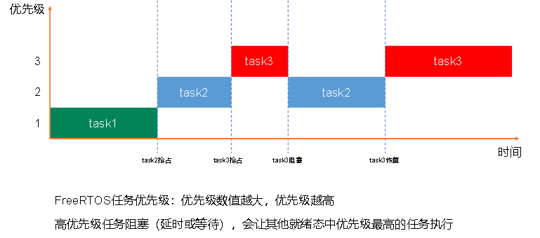
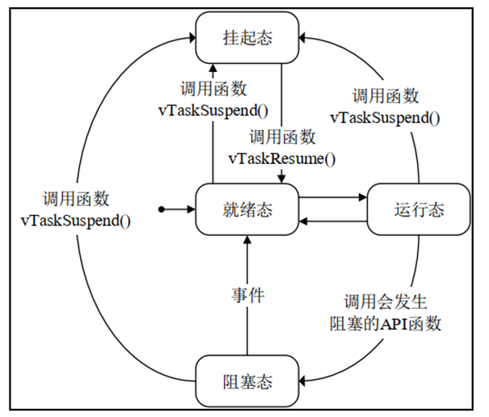
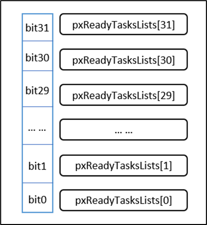
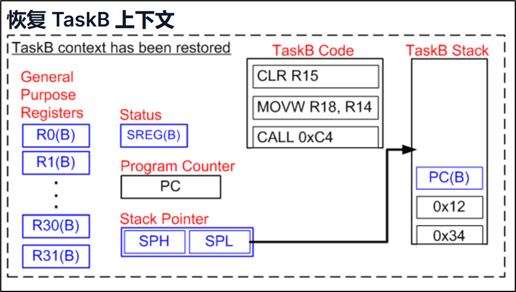

# 1 裸机开发与操作系统

一般是一行接着一行走，阻塞式开发，实时性不好，所以需要一个操作系统去调度。

- 通用操作系统：如 Windows、Linux  
- 实时操作系统：仍然需要写各种驱动，但是相较于裸机编程增加了调度，效率更高  

`thread`：操作系统的一个功能，在给定时间内完成任务。

---

# 2 FreeRTOS

## 2.1 基础知识

是实时操作系统的一款。

**并行和并发：**

- 并行：多个任务在同时进行  
- 并发：多个任务在进行  
- 并行是并发的一种  

调度过程同时有：

- 抢占式轮询（高低优先级）
- 时间片轮询（优先级相同）

同时也要看任务是否准备好。



当某个任务没做完一个时间片就完成任务，那么将立马切换到下一个任务。

---

## 2.2 运行状态机

- **运行态**：占用 CPU，正在运行  
- **就绪态**：随时能进行运行的任务  
- **阻塞态**：运行到一半需要等某个资源，于是离开运行态等待，准备随时再切入运行  
- **挂起态**：任务暂停状态，不再计算优先级切入  



使用链表来实现此功能，如就绪列表：

```
pxReadyTasksLists[x]
```

其中 `x` 代表任务优先级数值。



---

## 2.3 时钟 SysTick

选用一个不会被打断的定时器。

- 时间片长度一般为 `tick + 1`

每次滴答数增加时，实时内核必须检查是否现在是解除阻塞或唤醒任务的时间。

在滴答 ISR 期间唤醒或解除阻塞的任务，其优先级可能高于被中断任务的优先级。

---

## 2.4 上下文切换

上下文为任务运行时产生的数据和计算结果等。

将数据存入 stack 里，`stack pointer` 指栈顶指针，存在 CPU 中，方便恢复的时候切换回来。



上下文切换使用 `PendSV` 功能，一般将 `PendSV` 优先级设为最低，配合 `SysTick` 中断，步骤如下：

- SysTick + 1  
- 阻塞列表是否有到点的  
- 就绪列表是否有可以切换的  
- 返回 1 或者 0  

当一个时间片内任务完成，任务也会触发 `PendSV` 进行切换。

---

## 2.5 空闲任务

当 MCU 没有任务需要运行的时候，使用 `idle task` 填充，优先级最低。

同时，空闲任务负责释放被删除的任务的内存。
